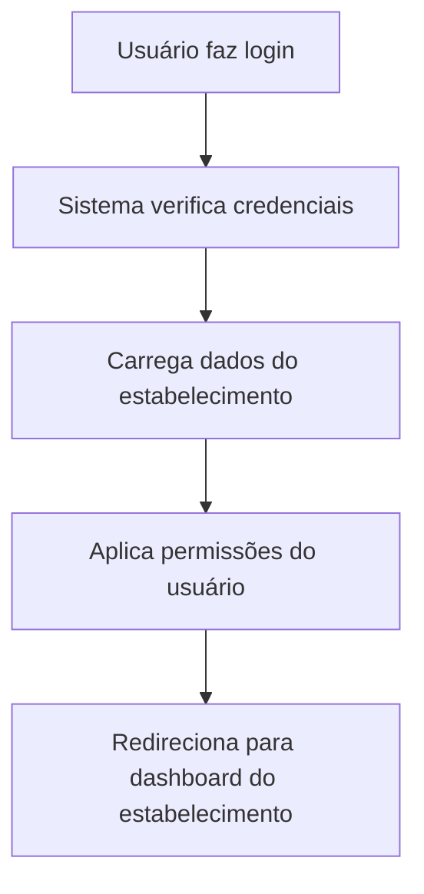

# 🏢 Sistema Multi-Estabelecimentos - Unclic Manager

## ✅ **ARQUITETURA MULTI-TENANT IMPLEMENTADA**

O Unclic Manager agora suporta **múltiplos estabelecimentos** com dados completamente isolados e seguros. Cada estabelecimento tem:

- ✅ **Dados isolados** - Cada estabelecimento só vê seus próprios dados
- ✅ **Usuários independentes** - Cada estabelecimento gerencia seus usuários
- ✅ **Autenticação segura** - Login baseado em estabelecimento
- ✅ **Sistema de permissões** - Controle de acesso por função
- ✅ **Onboarding personalizado** - Cada novo estabelecimento configura seus dados

---

## 🏗️ **Arquitetura do Sistema**

### **Estrutura Multi-Tenant**

```
┌─────────────────────────────────────────────────────────────┐
│                    UNCLIC MANAGER                           │
│                  (Sistema Principal)                        │
└─────────────────────────────────────────────────────────────┘
         │                    │                    │
         ▼                    ▼                    ▼
┌──────────────────┐ ┌──────────────────┐ ┌──────────────────┐
│  ESTABELECIMENTO │ │  ESTABELECIMENTO │ │  ESTABELECIMENTO │
│        A         │ │        B         │ │        C         │
├──────────────────┤ ├──────────────────┤ ├──────────────────┤
│ • Salão da Maria │ │ • Barba & Cia    │ │ • Studio Bella   │
│ • Dados isolados │ │ • Dados isolados │ │ • Dados isolados │
│ • Usuários       │ │ • Usuários       │ │ • Usuários       │
│ • Serviços       │ │ • Serviços       │ │ • Serviços       │
│ • Clientes       │ │ • Clientes       │ │ • Clientes       │
│ • Agendamentos   │ │ • Agendamentos   │ │ • Agendamentos   │
└──────────────────┘ └──────────────────┘ └──────────────────┘
```

### **Isolamento de Dados**

Cada estabelecimento tem seus dados completamente separados:

- **Clientes** - Cada estabelecimento só vê seus clientes
- **Serviços** - Catálogo independente por estabelecimento
- **Profissionais** - Equipe específica de cada estabelecimento
- **Agendamentos** - Agenda isolada por estabelecimento
- **Finanças** - Relatórios e receitas separadas
- **Configurações** - Horários, preços e regras independentes

---

## 👥 **Sistema de Usuários e Permissões**

### **Tipos de Usuário**

1. **👑 Proprietário (Owner)**

   - Acesso total ao estabelecimento
   - Pode gerenciar usuários e configurações
   - Pode ver relatórios financeiros completos

2. **🛡️ Administrador (Admin)**

   - Gerencia operações diárias
   - Pode adicionar/editar serviços e profissionais
   - Acesso a relatórios e clientes

3. **👔 Gerente (Manager)**

   - Foca em agendamentos e clientes
   - Pode gerenciar agenda e serviços
   - Relatórios limitados

4. **👤 Funcionário (Employee)**
   - Acesso básico para agendamentos
   - Pode ver clientes e sua agenda
   - Sem acesso a configurações

### **Matriz de Permissões**

| Funcionalidade             | Proprietário | Admin | Gerente | Funcionário |
| -------------------------- | ------------ | ----- | ------- | ----------- |
| Gerenciar Estabelecimento  | ✅           | ❌    | ❌      | ❌          |
| Gerenciar Usuários         | ✅           | ✅    | ❌      | ❌          |
| Gerenciar Serviços         | ✅           | ✅    | ✅      | ❌          |
| Gerenciar Profissionais    | ✅           | ✅    | ✅      | ❌          |
| Gerenciar Clientes         | ✅           | ✅    | ✅      | ❌          |
| Gerenciar Agendamentos     | ✅           | ✅    | ✅      | ✅          |
| Ver Relatórios Financeiros | ✅           | ✅    | ❌      | ❌          |
| Exportar Relatórios        | ✅           | ✅    | ❌      | ❌          |

---

## 🔐 **Fluxo de Autenticação**

### **Novo Estabelecimento**

```mermaid
flowchart TD
    A[Usuário acessa sistema] --> B[Clica em "Criar Conta"]
    B --> C[Preenche dados pessoais]
    C --> D[Preenche dados do estabelecimento]
    D --> E[Sistema cria estabelecimento + usuário proprietário]
    E --> F[Redireciona para onboarding]
    F --> G[Configura serviços, profissionais, horários]
    G --> H[Estabelecimento pronto para uso]
```

### **Usuário Existente**



---

## 💾 **Estrutura de Dados Multi-Tenant**

### **Tabelas Principais**

```sql
-- Estabelecimentos
establishments (
  id, name, email, phone, cnpj, address,
  subscription_plan, is_active, created_at
)

-- Usuários (vinculados a estabelecimentos)
users (
  id, establishment_id, name, email, role,
  is_active, created_at
)

-- Serviços (por estabelecimento)
services (
  id, establishment_id, name, price, duration,
  category, is_active, created_at
)

-- Clientes (por estabelecimento)
clients (
  id, establishment_id, name, email, phone,
  total_visits, total_spent, created_at
)

-- Agendamentos (por estabelecimento)
appointments (
  id, establishment_id, client_id, professional_id,
  service_id, date, status, created_at
)
```

### **Filtros Automáticos**

Todas as consultas incluem automaticamente o filtro `establishment_id` para garantir isolamento:

```typescript
// Exemplo: Buscar clientes
const clients = await db.clients.findMany({
  where: {
    establishment_id: user.establishment_id, // Sempre filtrado
    is_active: true,
  },
});
```

---

## 🎯 **Fluxo de Onboarding Multi-Tenant**

### **Etapas do Onboarding**

1. **🏢 Dados do Estabelecimento**

   - Nome, endereço, contato
   - Logo e banner
   - Informações fiscais (CNPJ)

2. **👤 Dados do Proprietário**

   - Nome completo
   - E-mail e telefone
   - Foto de perfil

3. **💼 Serviços Oferecidos**

   - Catálogo de serviços
   - Preços e durações
   - Categorias

4. **👥 Equipe de Profissionais**

   - Cadastro da equipe
   - Especialidades
   - Horários de trabalho

5. **⏰ Horários de Funcionamento**

   - Dias e horários
   - Pausas e intervalos
   - Configurações especiais

6. **✅ Revisão e Finalização**
   - Confirmação dos dados
   - Ativação do estabelecimento

---

## 🛡️ **Segurança e Isolamento**

### **Medidas de Segurança Implementadas**

1. **🔒 Isolamento de Dados**

   - Todas as consultas filtradas por `establishment_id`
   - Impossível acessar dados de outros estabelecimentos

2. **🎫 Controle de Sessão**

   - JWT tokens com informações do estabelecimento
   - Validação de permissões em cada request

3. **🚪 Controle de Acesso**

   - Sistema de permissões granular
   - Bloqueio de funcionalidades por papel

4. **📝 Auditoria**
   - Logs de acesso e modificações
   - Rastreabilidade de ações

### **Validações de Segurança**

```typescript
// Exemplo de validação no backend
const validateEstablishmentAccess = (
  user: User,
  resourceEstablishmentId: string,
) => {
  if (user.establishment_id !== resourceEstablishmentId) {
    throw new Error("Acesso negado: estabelecimento inválido");
  }
};
```

---

## 📊 **Planos de Assinatura**

### **Planos Disponíveis**

1. **🆓 Gratuito**

   - 1 estabelecimento
   - 2 usuários
   - 100 clientes
   - Funcionalidades básicas

2. **💼 Básico**

   - 1 estabelecimento
   - 5 usuários
   - 500 clientes
   - Relatórios básicos

3. **⭐ Premium**

   - 1 estabelecimento
   - Usuários ilimitados
   - Clientes ilimitados
   - Relatórios avançados
   - Integrações

4. **🏢 Empresarial**
   - Múltiplos estabelecimentos
   - Usuários ilimitados
   - White-label
   - Suporte prioritário

---

## 🔄 **Migração e Escalabilidade**

### **Recursos de Escalabilidade**

1. **📈 Crescimento Horizontal**

   - Cada estabelecimento pode crescer independentemente
   - Sem impacto em outros estabelecimentos

2. **🔄 Backup Independente**

   - Backup separado por estabelecimento
   - Restauração seletiva

3. **📊 Monitoramento Individual**
   - Métricas por estabelecimento
   - Performance isolada

### **Migração de Dados**

```typescript
// Exemplo de migração para multi-tenant
const migrateToMultiTenant = async () => {
  // 1. Criar estabelecimento padrão
  const establishment = await createEstablishment(defaultData);

  // 2. Migrar dados existentes
  await migrateExistingData(establishment.id);

  // 3. Atualizar usuários
  await updateUserEstablishments(establishment.id);
};
```

---

## 🚀 **Como Usar o Sistema Multi-Tenant**

### **Para Novos Estabelecimentos**

1. Acesse a tela de login
2. Clique em "Criar Conta"
3. Preencha dados pessoais e do estabelecimento
4. Complete o onboarding
5. Comece a usar o sistema

### **Para Usuários Existentes**

1. Faça login com suas credenciais
2. O sistema carrega automaticamente seu estabelecimento
3. Acesse apenas os dados do seu estabelecimento
4. Convide outros usuários se necessário

### **Gerenciamento de Usuários**

1. Proprietários podem adicionar usuários
2. Defina o papel de cada usuário
3. Usuários recebem convite por e-mail
4. Acesso baseado em permissões

---

## 🎊 **Benefícios do Sistema Multi-Tenant**

### **Para os Estabelecimentos**

- ✅ **Dados seguros e isolados**
- ✅ **Gestão independente**
- ✅ **Escalabilidade individual**
- ✅ **Personalização completa**

### **Para a Plataforma**

- ✅ **Crescimento escalável**
- ✅ **Receita recorrente**
- ✅ **Manutenção eficiente**
- ✅ **Custos otimizados**

### **Para os Usuários**

- ✅ **Interface familiar**
- ✅ **Permissões claras**
- ✅ **Foco no seu estabelecimento**
- ✅ **Colaboração eficiente**

---

## 🔮 **Próximos Passos**

### **Funcionalidades Planejadas**

1. **🔄 Troca de Estabelecimentos**

   - Usuários com acesso a múltiplos estabelecimentos
   - Switch rápido entre estabelecimentos

2. **📊 Relatórios Consolidados**

   - Visão geral de múltiplos estabelecimentos
   - Dashboard executivo

3. **🎨 White-label**

   - Personalização visual por estabelecimento
   - Domínio próprio

4. **🔗 API para Integrações**
   - Webhooks para eventos
   - API REST completa

## ✨ **Conclusão**

O **Unclic Manager** agora é uma plataforma verdadeiramente **multi-tenant**, permitindo que cada estabelecimento tenha seu ambiente isolado e seguro, com controle total sobre seus dados e usuários.

A arquitetura garante escalabilidade, segurança e uma experiência personalizada para cada negócio! 🚀
