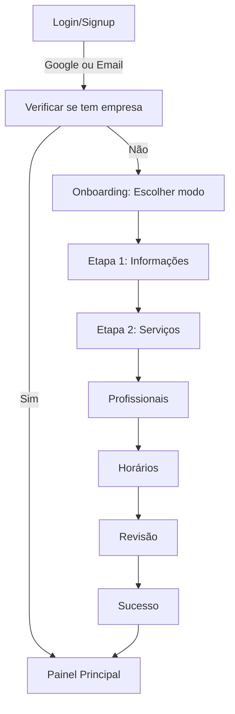

# Sistema de Onboarding - Unclic Manager

## Visão Geral

O sistema de onboarding do Unclic Manager foi implementado seguindo o design fornecido, criando uma experiência fluida e progressiva para novos usuários configurarem seus estabelecimentos.

## Funcionalidades Principais

### 🔐 **Etapa 0 — Autenticação**

- **Tela de Login** com três opções:
  - ✅ Entrar com Google (OAuth) - _simulado_
  - ✉️ Entrar com e-mail e senha
  - 🆕 Cadastrar nova conta
- **Redirecionamento inteligente**: usuários autenticados são direcionados para o onboarding ou dashboard dependendo do status
- **Persistência de sessão** através do localStorage

### 👋 **Etapa 1 — Boas-vindas**

- **Três opções de configuração**:
  - 📥 Importar de outro sistema (Trinks, Booksy) → _Em breve_
  - 📄 Upload de planilha/PDF → _Em breve_
  - ✅ **Começar do zero** (implementado e recomendado)
- **Mini-tutorial visual** explicando as próximas etapas
- **Botão destacado** para a opção recomendada

### 🧩 **Etapa 2 — Configuração em Wizard**

#### 2.1 — Informações do Negócio

- **Campos obrigatórios**: Nome, e-mail, telefone, endereço, CEP
- **Campos opcionais**: CNPJ, site, redes sociais
- **Upload de imagens**: Logo e banner
- **Validação em tempo real** com feedback visual
- **Máscaras de formatação** para telefone, CEP e CNPJ

#### 2.2 — Serviços

- **Duas abas**:
  - **Modelos Prontos**: Serviços pré-configurados por categoria
  - **Personalizado**: Criação manual de serviços
- **Categorias incluídas**: Cabelo, Barba, Sobrancelha, Unhas, Tratamento
- **Gestão completa**: Adicionar, editar, remover serviços
- **Validação**: Pelo menos um serviço deve ser cadastrado

#### 2.3 — Profissionais

- **Informações completas**: Nome, função, tipo de vínculo, contato
- **Recursos visuais**: Foto opcional, cor do calendário
- **Especialidades**: Vincular serviços aos profissionais
- **Dias de trabalho**: Seleção dos dias da semana
- **Validação**: Pelo menos um profissional deve ser cadastrado

#### 2.4 — Horários de funcionamento

- **Configuração por dia** da semana
- **Recursos avançados**:
  - Pausa para almoço configurável
  - Botão "copiar para todos os dias"
  - Visualização em tempo real dos horários
- **Interface intuitiva** com switches para abrir/fechar

#### 2.5 — Revisão Final

- **Resumo completo** de todas as configurações
- **Edição rápida** com botões para voltar às etapas anteriores
- **Cards organizados** por seção
- **Progresso visual** das etapas concluídas

### 🎯 **Etapa 3 — Finalização e Sucesso**

- **Tela de congratulações** com animações
- **Sugestões de próximos passos**:
  - 🔔 Testar agendamento
  - 💬 Ativar WhatsApp
  - 📲 Baixar app (em breve)
- **Botão principal** para ir ao dashboard
- **Links úteis** para suporte e documentação

## Características Técnicas

### 🎨 **Interface e UX**

- **Barra de progresso visual** em todas as etapas
- **Indicadores de etapas** numerados com status
- **Salvamento automático** no localStorage
- **Validação em tempo real** com feedback imediato
- **Responsive design** para mobile e desktop
- **Tema escuro/claro** suportado

### 🔧 **Arquitetura**

- **Context API** para gerenciamento de estado
- **Custom hooks** para lógica reutilizável
- **TypeScript** para tipagem forte
- **Componentes modulares** e reutilizáveis
- **Separação clara** entre UI e lógica de negócio

### 📡 **Integração Backend**

- **Controllers específicos** para onboarding
- **Validação de dados** no servidor
- **Persistência no Neon PostgreSQL**
- **APIs RESTful** para cada etapa
- **Tratamento de erros** robusto

### 🗂️ **Estrutura de Arquivos**

```
src/
├── components/onboarding/
│   ├── OnboardingFlow.tsx       # Componente principal
│   ├── WelcomeStep.tsx          # Tela de boas-vindas
│   ├── BusinessInfoStep.tsx     # Informações do negócio
│   ├── ServicesStep.tsx         # Cadastro de serviços
│   ├── ProfessionalsStep.tsx    # Cadastro de profissionais
│   ├── ScheduleStep.tsx         # Horários de funcionamento
│   ├── ReviewStep.tsx           # Revisão final
│   └── SuccessStep.tsx          # Tela de sucesso
├── contexts/
│   └── OnboardingContext.tsx    # Context para estado global
├── hooks/
│   └── useOnboarding.ts         # Hooks customizados
├── lib/
│   ├── onboardingTypes.ts       # Tipos TypeScript
│   └── onboardingApi.ts         # Cliente da API
└── pages/
    ├── Login.tsx                # Página de login
    └── Onboarding.tsx           # Página principal do onboarding
```

### 🛡️ **Validações e Segurança**

- **Validação de campos obrigatórios**
- **Formatação automática** de dados
- **Sanitização de inputs**
- **Verificação de tipos** com TypeScript
- **Tratamento de erros** com fallbacks

### 💾 **Persistência de Dados**

- **LocalStorage** para progresso temporário
- **Neon PostgreSQL** para dados finais
- **Transações** para consistência
- **Backup automático** do progresso

## Fluxo de Autenticação



## Melhorias Futuras

### 📥 **Importação de Dados**

- Integração com sistemas populares (Trinks, Booksy, Meethub)
- Upload e processamento de planilhas
- Mapeamento automático de campos

### 🤖 **Inteligência Artificial**

- Preenchimento automático com IA
- Sugestões baseadas no tipo de negócio
- Otimização de horários e preços

### 📱 **Mobile**

- Aplicativo móvel nativo
- Onboarding específico para mobile
- Sincronização offline

### 🔗 **Integrações**

- WhatsApp Business API
- Google Calendar
- Sistemas de pagamento
- Redes sociais

## Status de Implementação

### ✅ **Implementado**

- Sistema completo de onboarding
- Autenticação básica (mock)
- Persistência no Neon PostgreSQL
- Interface responsiva
- Validações completas

### 🚧 **Em Desenvolvimento**

- Autenticação real com OAuth
- Upload de arquivos para storage
- Importação de dados

### 📋 **Planejado**

- Aplicativo móvel
- IA para preenchimento automático
- Integração com WhatsApp

## Como Usar

1. **Faça login** ou crie uma conta
2. **Escolha "Começar do zero"** na tela de boas-vindas
3. **Preencha as informações** do seu estabelecimento
4. **Configure seus serviços** usando modelos ou criando personalizados
5. **Adicione profissionais** e suas especialidades
6. **Defina horários** de funcionamento
7. **Revise** todas as informações
8. **Finalize** e comece a usar o sistema

O sistema salva automaticamente o progresso e permite voltar a qualquer etapa para edições.
